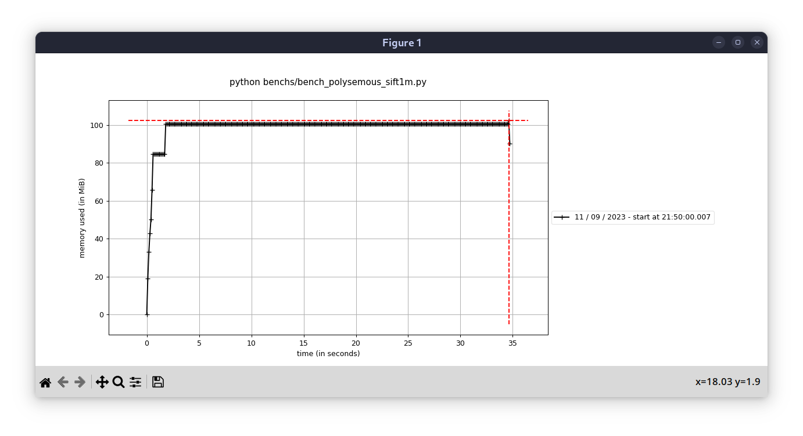

# Results

## Polysemous_ANN_128K benchmark

### Memory

-  from mprofile while running Polysemous_ANN_128K benchmark

### CPU usage

-  using `perf record python benchs/bench_polysemous_sift1m.py` -> `perf report`
  - Mainly the following command invocation were responsible for CPU usage:
  
  ```sh
  20.52%  python   _swigfaiss_avx2.cpython-311-x86_64-linux-gnu.so    [.] 0x00000000005ee040
  16.86%  python   _swigfaiss_avx2.cpython-311-x86_64-linux-gnu.so    [.] 0x00000000005ee06f
  15.49%  python   _swigfaiss_avx2.cpython-311-x86_64-linux-gnu.so    [.] 0x00000000005ee047
  12.76%  python   _swigfaiss_avx2.cpython-311-x86_64-linux-gnu.so    [.] 0x00000000005ee08d
  2.95%  python   _swigfaiss_avx2.cpython-311-x86_64-linux-gnu.so    [.] 0x00000000005ee0a4
  2.76%  python   _swigfaiss_avx2.cpython-311-x86_64-linux-gnu.so    [.] 0x00000000005ee09f
  .....
  ```

## HNSW Benchmark

### Steps to reproduce

- Download `sift1M` using `curl -O ftp://ftp.irisa.fr/local/texmex/corpus/sift.tar.gz && tar -xvf sift.tar.gz`
- Rename `sift/` to `sift1M/`
- Run [benchmark](./benchs/bench_hnsw.py) by `python benchs/hnsw_benchmark.py 10`, `k=10` denoting the number of neighbors to search.

### Logs

- [Results](./results/hnsw_benchmark_k10.txt)

### CPU usage

- [CPU usage](./results/hnsw_benchmark_cpu_usage.txt) can be recorded using `perf record python benchs/bench_hnsw.py 10` -> `perf report`
- Mainly the following command invocation were responsible for CPU usage:
  
  ```sh
  26.62%  python   _swigfaiss_avx2.cpython-311-x86_64-linux-gnu.so    [.] 0x000000000070bcb1
  17.57%  python   _swigfaiss_avx2.cpython-311-x86_64-linux-gnu.so    [.] 0x00000000005e4820
    8.20%  python   _swigfaiss_avx2.cpython-311-x86_64-linux-gnu.so    [.] 0x000000000070bdda
    5.86%  python   _swigfaiss_avx2.cpython-311-x86_64-linux-gnu.so    [.] 0x000000000070bd28
    3.37%  python   _swigfaiss_avx2.cpython-311-x86_64-linux-gnu.so    [.] 0x000000000070bcd7
    2.40%  python   _swigfaiss_avx2.cpython-311-x86_64-linux-gnu.so    [.] 0x000000000070bd78
    1.86%  python   _swigfaiss_avx2.cpython-311-x86_64-linux-gnu.so    [.] 0x00000000005e4800
    1.68%  python   _swigfaiss_avx2.cpython-311-x86_64-linux-gnu.so    [.] 0x000000000070bcac
    1.18%  python   _swigfaiss_avx2.cpython-311-x86_64-linux-gnu.so    [.] 0x00000000005e47c4
    1.13%  python   libgomp-a34b3233.so.1.0.0                          [.] omp_set_lock
    1.09%  python   _swigfaiss_avx2.cpython-311-x86_64-linux-gnu.so    [.] 0x00000000005e4883
    ...
  ```
